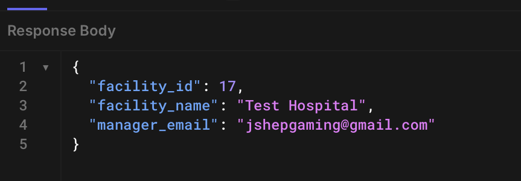
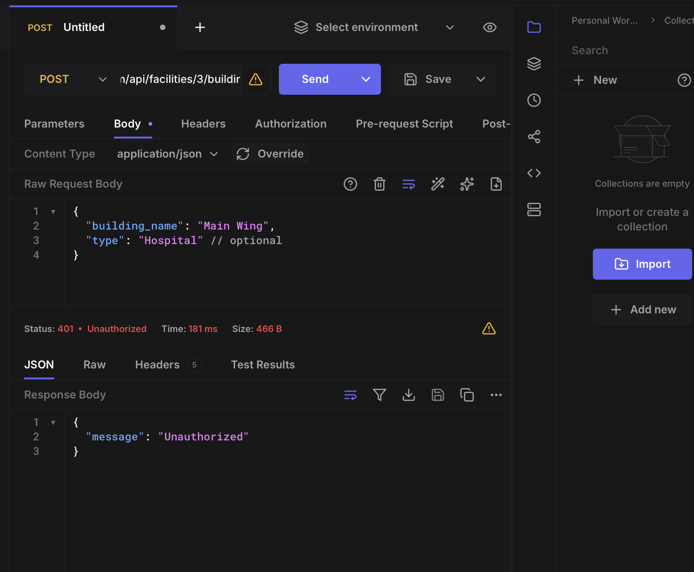
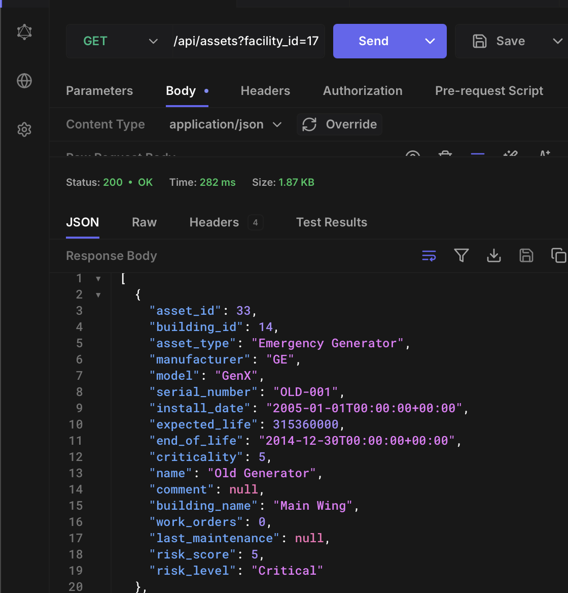
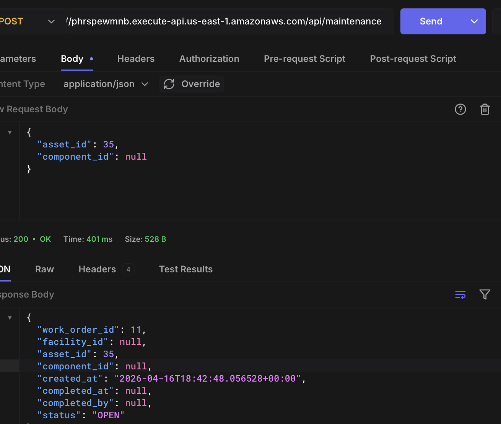
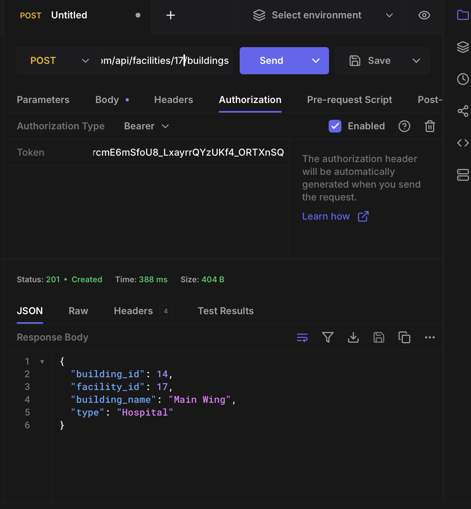
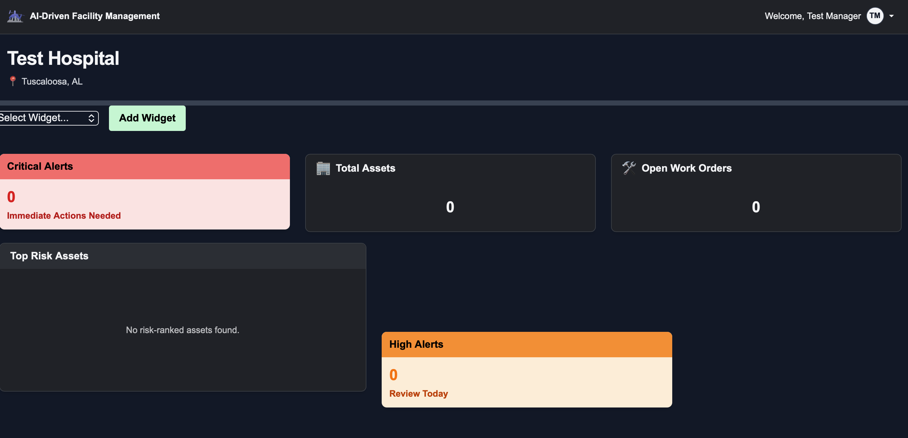
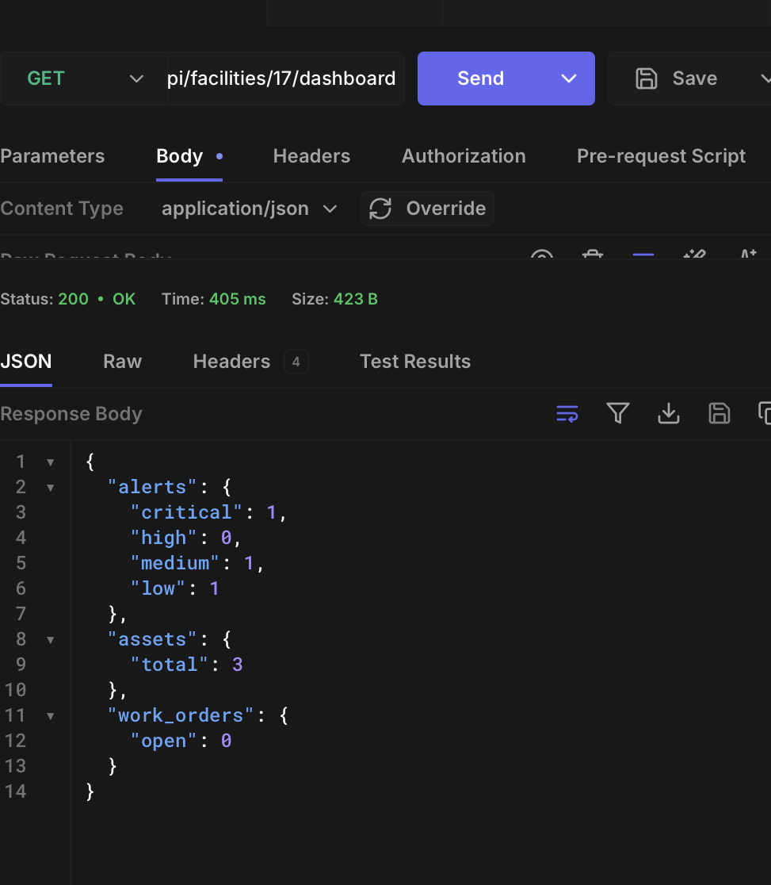
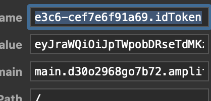

# Testing Documentation for Facility Management API

## Components / Services Tested

The following backend components will be tested:

- **Facilities Service**
  - Create, update, delete, and retrieve facilities
- **Buildings Service**
  - CRUD operations for buildings within a facility
- **Assets Service**
  - Asset creation, updates, and retrieval
  - Risk score calculation logic
- **Maintenance Service**
  - Work order creation, retrieval, and completion
- **Authentication & Authorization**
  - JWT validation via AWS Cognito
  - Role-based access control using `require_facility_role`

---

## Significant Test Cases

### 1. Facility Creation
- Created a facility using POST `/api/facilities`

Expected:
- Facility is created and stored in database
- User assigned as "Facility Manager"

Actual:
- Facility successfully created and returned in response



---

### 2. Token Enforcement
- Attempted protected route without a JWT token

Expected:
- 401 unauthorized

Actual:
- API returned 401 with appropriate error message



---
### 3. Asset Creation & Risk Calculation
- Created assets with different install dates

Verified:
- Criticality assigned based on asset type
- Risk score increases with asset age
- Assets past expected life marked as "Critical"



---
### 4. Maintenance Lifecycle
- Created work order via POST `/api/maintenance`
- Completed work order via PUT `/api/maintenance/{id}/complete`

Verified:
- Status transitions from OPEN → COMPLETE
- `completed_at` timestamp is set



---
### 5. Building Creation
- Created a building using POST `/api/facilities/{facility_id}/buildings`

Expected:
- Building is created and linked to the correct facility

Actual:
- Building successfully created and returned in response



---

### 6. Filtering & Query Validation
- Tested:
  - `/api/assets?facility_id={id}`
  - `/api/assets?facility_id={id}&building_id={id}`
  - `/api/maintenance?facility_id={id}&status=OPEN`
- Verified:
  - Results filtered correctly

---

## Test Coverage Summary

- All core services tested (Facilities, Buildings, Assets, Maintenance)
- Authorization validated across multiple roles
- Risk calculation verified under multiple conditions
- Edge cases handled (duplicate users, unauthorized access)

---
## Test Scripts / Execution

Testing was performed manually using API tools:

- **Hoppscotch / Postman**
- **FastAPI Swagger UI (`/docs`)**
- **curl commands**

### Example Request

```bash
curl -X GET \
  "https://<api-url>/api/assets?facility_id=1" \
  -H "Authorization: Bearer <jwt_token>"

```

### Other Pictures



